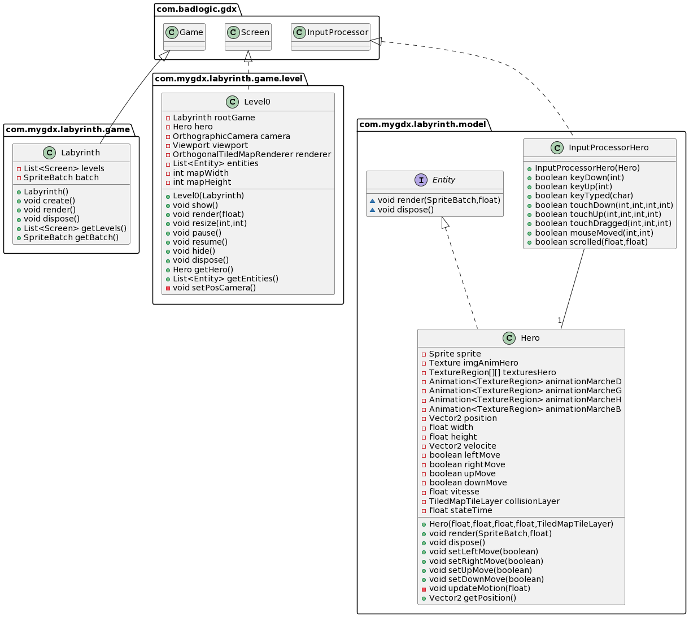
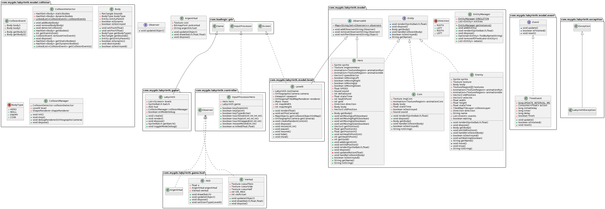

# labyrinth
University ACL Project 

# Utilisation

- `./gradlew desktop:dist` pour build un .jar  dans le dossier `/labyrinth/desktop/build/libs/desktop-num.version.jar`  
- Exécuter le .jar

# Fonctionnalités

## Résumé du jeu :

Le jeu est un style ARPG, vu du dessus à la Zelda. Le joueur aura un arc, pour se défendre devra affronter plusieurs ennemis dans un dans une sorte de donjon, une fois tous les ennemis vaincus, il pourra passer au niveau suivant. Une fois tous les niveaux finis le cycle recommence mais en plus difficile. 

### Héros :
Il est placé dans une salle de départ et peut se déplacer de salle en salle.
Il peut attaquer les ennemis à proximité ou à distance selon ses équipements.
Il peut être affecté par les effets des cases sur lesquelles il se déplace.

### Map : 
La map est définie par un fichier créer avec TiledMap
Il y aura des éléments avec lesquels le héro pourra intéragir.
Un système de salles
La map contiendra des ennemis
La map est générée en fonction du niveau sélectionné

Certains cases de la map sont spéciales :
pièges : quand un personnage arrive sur la case il subit des dégâts 
magiques : si un personnage arrive sur la case un effet est déclenché 
passages : un personnage qui arrive sur la case est téléporté à un autre endroit

### Monstres :
Des monstres sont placés de manière aléatoire dans le labyrinthe.
Les monstres se déplacent de manière aléatoire.
Les monstres se déplacent de manière intelligente en essayant d’attraper le héros.

### Attaques :
Le héros est tué au contact d’un monstre.
Le héros peut attaquer les monstres avec lesquelles il est en contact - les deux perdent des points de vie.
Le héros peut attaquer les monstres sur la case adjacente.

# Sprint 0 :

Affichage d’une fenêtre avec le héros qui se déplace à l’aide des flèches directionnelles ou des touches ZQSD. Le héros ne peut pas sortir des limites de la fenêtre.

- Affichage d’une fenêtre avec un fond noir              - 3  
- Affichage du héros                                     - 2  
- Déplacement du héros                                   - 2  
- Affichage des murs                                     - 2  
- Gestion des collisions (héros-murs)                    - 2  

## Sprint Review
Bugs au niveau des collisions à corriger.
Toutes les tâches ont été réalisées.

## Retrospective
Equipe peu présente.
Il faudrait un meilleur travail d'équipe et que le reste des membres vienne participer.

# Sprint 1
## Primaire  
- Correctifs des collisions.  
- Affichage de l'HUD (vie et score)  
  - Modifier la vie (soin/dégât)  
  - Incrémenter score  

- Monstre qui attaque mêlée  
  - Afficher  
  - Déplacement  
  - Attaque  
  
 - Attaque du héro à distance  
  - Ajout d'une arme  
  - Déplacement du projectile  
  - Collisions  

## Secondaire  
- Ramasser des pièces pour le score  
- Ajouter du son  

## Sprint Review

Faits :
 - Possibilité de ramasser des pièces     - 3
 - Ajout de l'ennemi                      - 4
 - Affichage de l'HUD                     - 4
 - Fix des Collisions                     - 3
 - Ajout de sons                          - 2     
 
Non faits : 
 - Attaque du héros                       - 5
 - Ajout d'une arme                       - 4
 - Gestion de projectiles                 - 4
 
Bugs à fixer :
 - Problèmes de collisions quand le monstre attaque le joueur
  
## Retrospective

Membres de l'équipe toujours présents Florent, Sacha et Marie-Luc qui sont présents pour travailler.
Les deux autres membres du groupe ne se sont toujours pas manifestés.

Problème au niveau de l'architecture du projet, architecture MVC non convenable.
Elle nous bloque sur certains points ce qui nous prendra plus de temps.

 
 

### Outils utilisés :

Langage : JAVA 11. 
TiledMap : Logiciel de création de map. 
Librairie Graphique : LibGDX.
Logiciel de Gestion de Projet : YouTrack  
https://labyrinth.youtrack.cloud/  
Outil de centralisation du code : GitHub  
https://github.com/MOBISARE/labyrinth  

